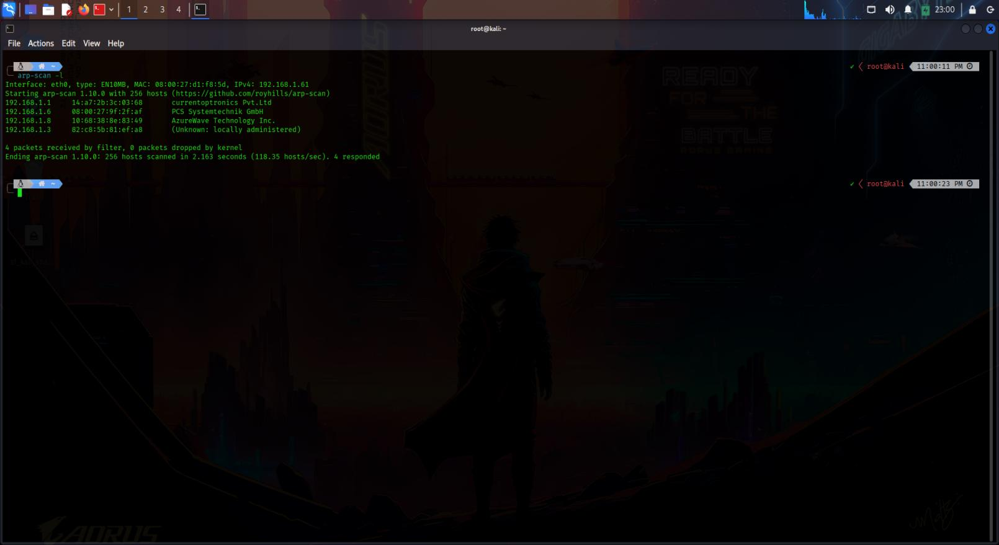
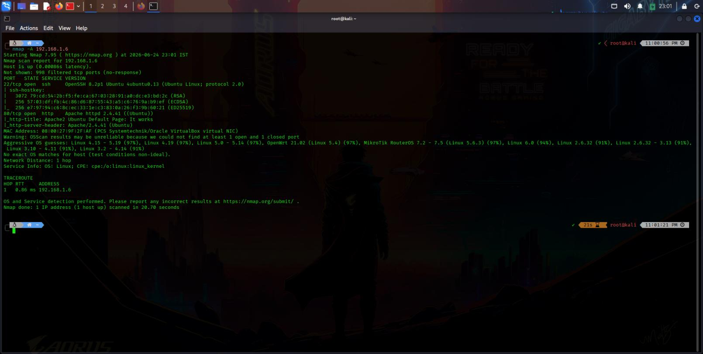
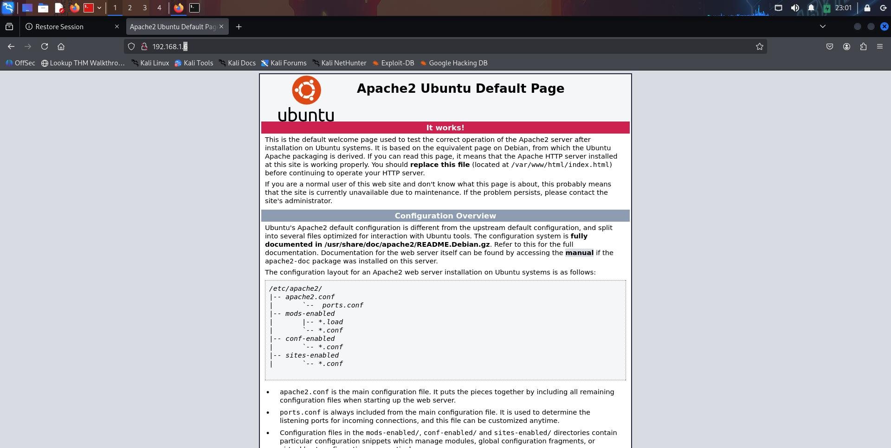
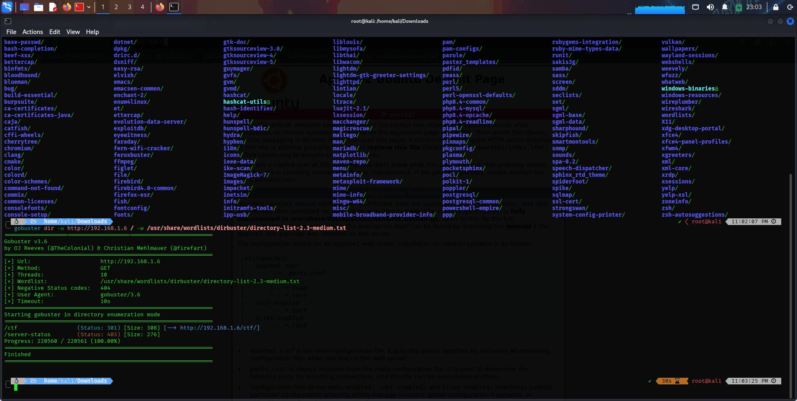
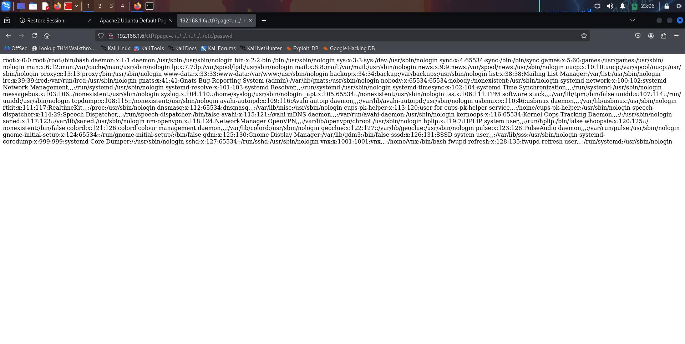
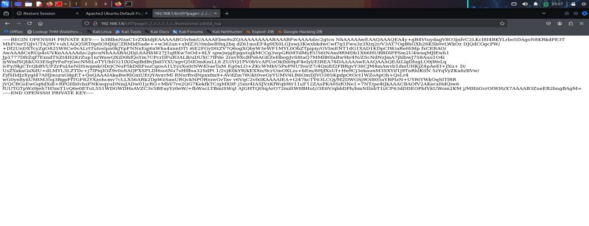
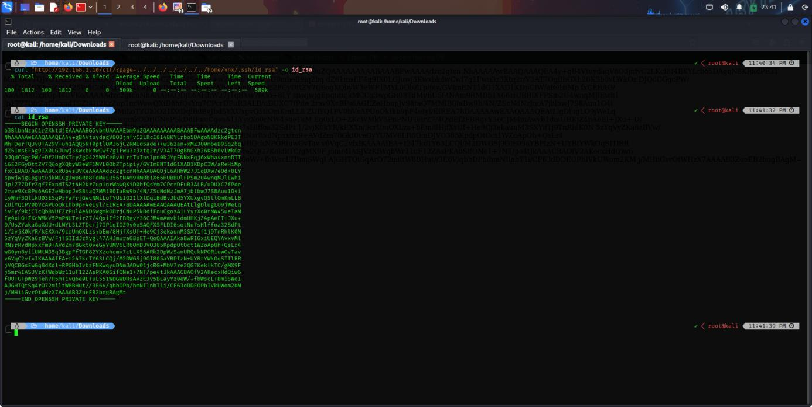
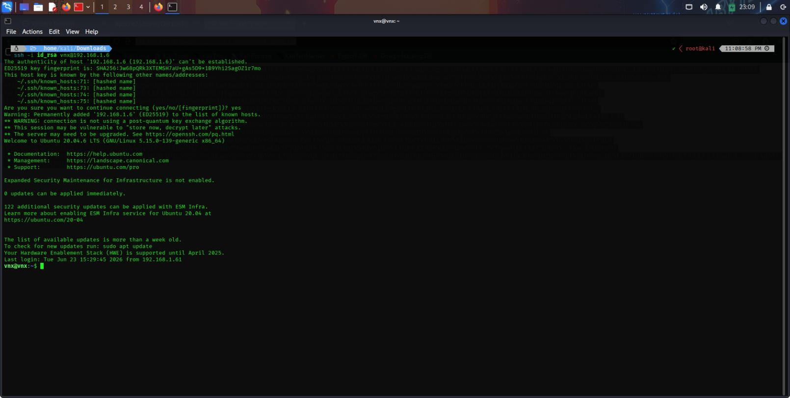
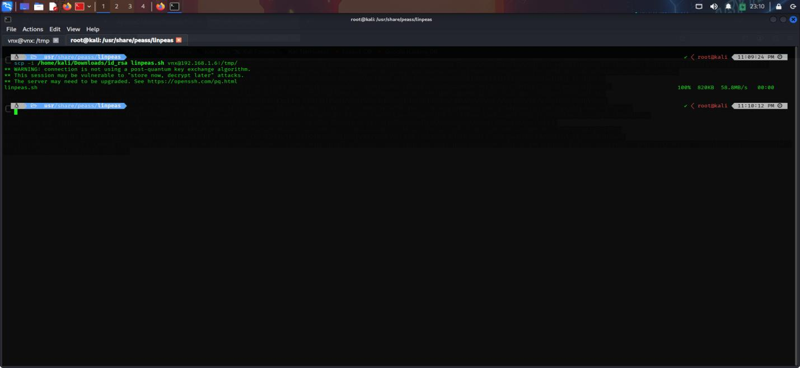
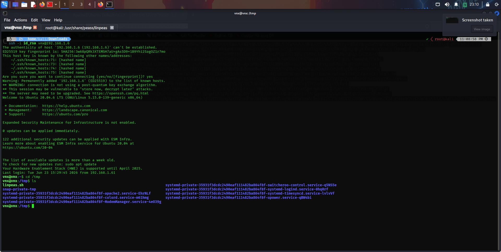

# Report: Docker Container Security and Privilege Escalation
### Local Privilege Escalation through Insecure Container Socket Volume Exposure

**Submitted as the project of the course:** Advanced Diploma in Cyber Defence
**By:** Ananthakrishnan K S
**Under the guidance of:** Mr. Saurav Sha
**RedTeam Hacker Academy, Kochi**

---

## 1. Introduction

### 1.1 Objective

This assessment performs an internal security evaluation and penetration test against an assigned lab target network. The engagement simulates an internal threat vector, demonstrating how an escalation sequence progresses from low-privileged initial access to full system compromise, and documents the process in a structured penetration test report.

### 1.2 Requirements

The report includes:
- A high-level summary and recommendations (non-technical)
- A walkthrough of the methodology and steps taken
- Each finding with screenshots, walkthrough, and proof (root flag)
- Any additional items observed during testing

### 1.3 High-Level Summary

An internal penetration test was performed against the lab target environment to evaluate misconfigured services and exploit permission flaws while logging administrative control vectors. During testing, a low-privileged shell was used to interact with a high-risk management daemon due to excessive group permissions and a loosely configured application socket. This resulted in full root-level access to the host and successful flag extraction.

### 1.4 Recommendations

- Harden user privilege baselines; restrict access to local application sockets so unprivileged operators cannot reach the underlying OS filesystem.
- Enforce strict group policies — audit and remove non-administrative accounts from privileged groups (e.g. `docker`).
- Run container workloads under rootless namespaces where possible.
- Maintain a regular patch and maintenance cadence to reduce exposure to escalation vectors.

---

## 2. Methodology

A structured penetration testing lifecycle was followed:

```
+------------------------+     +------------------------+     +------------------------+
| Information Gathering | --> |  Service Enumeration   | --> |      Penetration       |
+------------------------+     +------------------------+     +------------------------+
                                                                          |
                                                                          v
+------------------------+     +------------------------+     +------------------------+
|     House Cleaning     | <-- |    Maintaining Access  | <-- |    Post-Exploitation   |
+------------------------+     +------------------------+     +------------------------+
```

### 2.1 Information Gathering
Local subnet mapping was used to identify live targets on the network.

- **Target workspace network:** `192.168.1.6` (VNX target host)
- **Kali attacking machine:** `192.168.1.11`

### 2.2 Service Enumeration
Focused on identifying running services, processes, and daemons — active local groups, identity permissions, socket access controls, and available compiler binaries — to map potential attack vectors.

### 2.3 Penetration
An offline sideloading channel was used to introduce a lightweight container runtime image onto the target filesystem, mounting the host root partition to break out of the standard sandbox boundary.

### 2.4 Maintaining Access
Root shell access was used to inspect the local shadow file, and to directly reset a system account password to establish a persistent, interactive login path via the GUI.

### 2.5 House Cleaning
After flag verification, staged tar archives were removed from `/tmp`, intermediate container state was torn down, and the workspace was returned to its original baseline.

---

## 3. Lab Assessment — Target: 192.168.1.6 (vnx)

### 3.1.1 Initial Access — Local Docker Socket Volume Mount Leads to Host Filesystem Breakout

**Vulnerability:** The low-privileged user `vnx` was a member of the local `docker` group. Because the Docker daemon socket (`/var/run/docker.sock`) runs as root, any user able to communicate with it can issue high-level container management requests — including instantiating a container that mounts the host's entire root filesystem (`/`) into the container. Using `chroot`, the attacker changes the shell's root context, fully breaking container isolation and gaining unrestricted read/write/admin control over the host.

**Fix:** Restrict access to the Docker socket. Audit local group memberships and remove non-administrative accounts from `docker`. Where unprivileged container execution is required, use a rootless runtime or an authorization wrapper that blocks high-risk flags (`-v`, `--mount`).

**Severity:** Critical

### 3.1.2 Service Enumeration

| IP Address | Ports Open |
|---|---|
| 192.168.1.6 | Local shell session established |

An `arp-scan` was run to map live hosts on the subnet:

```
root@kali:/home/kali/Downloads# arp-scan -l
```



An `nmap` scan confirmed two exposed services:

- **Port 22/tcp (SSH):** Used for initial low-privileged access.
- **Port 80/tcp (HTTP):** Hosting a local web application.





A `gobuster` directory scan against the web root found:

- `/ctf/` (301) → active challenge sub-directory at `http://192.168.1.9/ctf/`
- `/server-status` (403) → default Apache status endpoint, access restricted



### 3.1.3 Vulnerability Analysis — Local File Inclusion (LFI) in CTF Portal

The `/ctf/` application exposed a `?page=` parameter with no apparent sanitation. A directory traversal payload confirmed the flaw:

```
http://192.168.1.9/ctf/?page=../../../../etc/passwd
```

The application rendered the full contents of `/etc/passwd`, revealing a non-administrative user context: `vnx`.



### 3.1.4 Initial Access — SSH Private Key Extraction via LFI

The same LFI flaw was used to pull the user's private SSH key:

```
http://192.168.1.9/ctf/?page=../../../../home/vnx/.ssh/id_rsa
```

The unencrypted RSA private key was returned directly in the response.



### 3.1.5 Staging and Validating the Extracted Key

```
curl "http://192.168.1.9/ctf/?page=../../../../home/vnx/.ssh/id_rsa" -o id_rsa
```



### 3.1.6 Remote Session Interactivity and Initial Foothold

```
root@kali:/home/kali/Downloads# chmod 600 id_rsa
root@kali:/home/kali/Downloads# ssh -i id_rsa vnx@192.168.1.6
```



### 3.1.7 Automated Security Auditing via LinPEAS

`linpeas.sh` was transferred and executed to confirm privilege escalation paths:

```
scp -i id_rsa linpeas.sh vnx@192.168.1.9:/tmp/linpeas.sh
```



LinPEAS flagged `vnx`'s membership in the `docker` group as a high-severity, direct escalation vector — confirming manual enumeration and the writable Docker daemon socket.



---

*Sections 4–6 (Exploitation Framework & Host Breakout, Post-Exploitation and Flag Retrieval, and the Vulnerability Summary & Remediation Matrix) are documented in [`03-Post-Exploitation-and-Remediation.md`](./03-Post-Exploitation-and-Remediation.md).*
